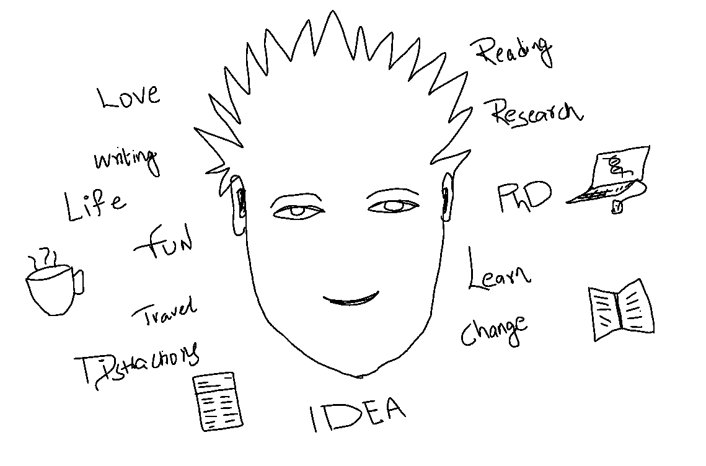

Thanks for stopping by. My name is Venu Thatikonda. I am a PhD student at [Deutsches Krebsforschungszentrum (DKFZ)](https://www.dkfz.de/en/index.html) / German Cancer Research Center.

## What is here?

I am an amateur writer alongside a researcher of Brain Cancer. I often ***"try"***
to write about the ***pleasures*** (and ***struggles***) of being a scientific researcher and also some of the *facepalm* moments I face during 
self development process.  

Here, you will find stories of different stages of a PhD student and sometimes science related articles (mostly related to my work). 

***Some more?***

I am a Computational Biologist and a *novice* Biology experimentalist.
Our lab’s main focus is to understand the ***(epi)gentic*** diversity of childhood brain tumors through various ***Next Generation Sequencing*** data analysis. We are a part of [ICGC-PedBrain Project](http://www.pedbraintumor.org/). We mainly develop computational methods and tools to decipher the underlying biological meaning from the Genomics data.

As [***Ronald Coase***](https://en.wikipedia.org/wiki/Ronald_Coase) says,

> ***If you torture the data long enough, it will confess.***

I always love to torture the so-called ***“Biological Big data”*** in order to get what is hiding behind **A,C,G,T** letters which could help explain the possible mechanisms to understand the cancer progression.


